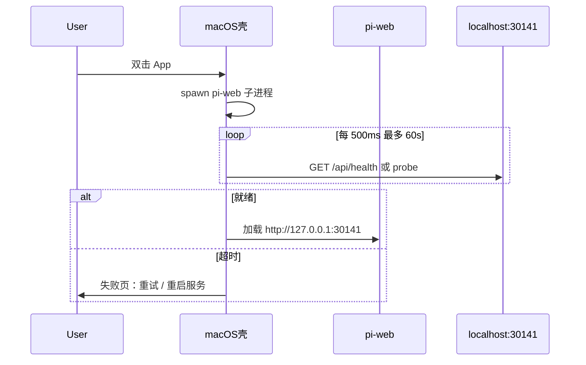

# M1 产品设计 & 技术方案

**版本**：2026-06-03  
**状态**：设计稿（待评审）  
**关联**：[总计划](./plan-pi-web-macos-workbench.md) · [M1 清单](./m1-checklist.md) · [贯穿原则](./product-principles.md)

---

## 0. 文档目的

为 M1（macOS 独立 App v1.0）提供可评审的**产品规格**与**实现蓝图**，使清单项（M1-A～H）有统一的交互、数据与接口约定。实现时以本文 + `m1-checklist.md` 为验收依据。

---

# 第一部分：产品设计

## 1. 用户与场景

| 角色 | 目标 | M1 是否服务 |
|------|------|-------------|
| **主用户** | 非技术知识工作者：装好即用、白话配置、场景开聊 | 是 |
| **进阶用户** | 需要会话树、完整工具预设、远程 | 是（「高级」入口，非默认路径） |
| **开发者** | 改 models.json、RPC、扩展 | 否（M1 不暴露裸 JSON / RPC） |

**核心场景（Happy Path）**

1. 双击 App → 等待本地服务就绪（≤30s 内可接受）。
2. 首次向导：选工作区 → 连至少一个 AI 服务 → 可选开通知 → 点场景卡片发首条消息。
3. 日常使用：打开即见场景首页；长对话自动整理、失败自动重试；任务结束收到通知；需要时导出 HTML。

**成功标准（与清单里程碑验收一致）**

- 新机器**无需单独安装 Node** 即可完成首聊。
- 自动整理 / 自动重试**默认开启**，设置中可关。
- 导出 HTML 在 Finder 中可打开。
- `agent_end` 触发系统通知，点击回到 `?session=<id>`。

---

## 2. 信息架构

```
Pi（macOS App）
├── 启动层（壳）          探活 / 重启服务 / 系统通知
└── pi-web（内嵌 WebView）
    ├── 首次向导          /?onboarding=1（门控，完成后隐藏）
    ├── 工作台首页        默认路由（场景卡片）
    ├── 对话              ?session=<id>
    ├── 历史              workbenchView=history
    ├── AI 服务           workbenchView=accounts（新）
    ├── 设置              workbenchView=settings
    └── 高级              侧栏会话树 + 完整 ToolPanel（显式进入）
```

**默认 vs 高级**

| 能力 | 默认用户 | 高级入口 |
|------|----------|----------|
| 入口 | 场景首页 | 侧栏「会话」或设置内链接 |
| 工具 | 简洁模式（能力描述） | 标准 / 完整预设 |
| 模型配置 | AI 服务页（OAuth + 默认模型） | 可保留 Models 弹窗给进阶 |
| 远程 / Bash / Skills 编辑 | 隐藏或折叠 | 设置底部「开发者」 |

---

## 3. 关键用户流程

### 3.1 启动与探活（M1-A）



**产品文案**

- 加载中：「正在启动 Pi…」
- 失败：「无法连接到 Pi 服务」+「重试」「重启服务」
- 菜单：退出 · 重启服务 · 打开数据文件夹（附一句：`对话与设置保存在本机，路径见说明`）

### 3.2 首次运行向导（M1-B）

**触发条件**（满足任一且未完成 onboarding 则显示）：

1. `GET /api/onboarding/status` 返回 `completed: false`，且  
2. 以下至少一项为真：无可用模型（`modelList.length === 0`）、无默认 provider、或 `~/.pi/agent` 首次创建。

**步骤（4 屏，可上一步）**

| 步 | 标题（zh-CN） | 行为 |
|----|---------------|------|
| 1 | 选择工作区 | 「使用推荐文件夹」→ `POST /api/default-cwd`；「选择其他文件夹…」→ 壳 `pickDirectory` 或 Web 暂用路径输入（M1 优先壳） |
| 2 | 连接 AI 服务 | 列出 2–4 个推荐 provider 卡片 + OAuth；至少一个成功才可下一步 |
| 3 | 完成通知 | 开关默认开；macOS 请求通知权限；说明可稍后在设置关闭 |
| 4 | 开始第一次对话 | 展示 3 个推荐场景；点击即 `launchScene` + 预填首条 prompt |

**完成**

- `POST /api/onboarding/complete` 写入 `pi-web-preferences.json`（见技术方案）。
- 跳转 `/?view=home`，不再强制向导。

### 3.3 AI 服务（M1-C）

独立页，**不复用** Models 弹窗作为主路径。

| 区块 | 内容 |
|------|------|
| 已连接 | provider 显示名、状态（已登录 / 需重新登录） |
| 添加服务 | 与现有 `/api/auth/login/[provider]` 相同 |
| 默认模型 | 下拉：仅已连接 provider 的模型 |
| 发消息前拦截 | 无账户 → 全屏轻提示 + CTA「去连接 AI 服务」 |

**白话**：不出现 provider API 术语；错误用「登录已过期，请重新连接」。

### 3.4 场景首页与工具（M1-D）

- **PR-01**：`AppShell` 初始 `workbenchView === "home"`；无 `?session=` 时不自动展开侧栏会话树。
- **PR-02**：`ChatInput` 工具区新增「简洁模式」：
  - 展示：`可读文件`、`可修改文件`、`可搜索网络`（由 preset 映射，非 `read`/`bash` 等内部名）。
  - 存储：`pi-web-preferences.json` → `toolMode: "simple" | "default" | "full"`，对应现有 `PRESET_*`。

### 3.5 设置：稳定性与结果（M1-E / F）

| 设置项 | 默认 | 说明 |
|--------|------|------|
| 自动整理长对话 | 开 | 对应 `set_auto_compaction` |
| 失败时自动重试 | 开 | 对应 `set_auto_retry` |
| 导出对话 | 按钮 | 生成 HTML，浏览器下载或壳「另存为」 |
| 本对话用量 | 只读 | 输入 / 输出 / 缓存 / 预估费用（白话） |

### 3.6 通知（M1-G）

| 通道 | 用户 | 实现 |
|------|------|------|
| macOS 系统通知 | App 用户（M1 主路径） | 壳监听 `agent_end` 或 Web `postMessage` |
| Web Push | 已订阅的浏览器/PWA | 保留 `notifyAgentFinished`，与系统通知并行不互斥 |

**深链**：`pi://open?session=<uuid>` 或 `http://127.0.0.1:30141/?session=<uuid>`（壳统一解析）。

---

## 4. 文案与 i18n（M1-H）

- 命名空间：`onboarding.*`、`accounts.*`、`settings.autoCompaction` 等。
- 语言：`zh-CN`、`en` 同步交付；禁止硬编码新增 UI 字符串。
- 术语表：遵循 [总计划 §1.2](./plan-pi-web-macos-workbench.md#12-术语对照ui-文案)。

---

## 5. M1 明确不做

- Sparkle 自动更新（PL-07 → M4）
- 多 Tab / `switch_session`（PI-14）
- 默认开启远程 / `0.0.0.0`
- TUI、裸 `models.json` 编辑、Bash 面板（默认用户）
- Gist `/share`（HTML 导出替代）

---

# 第二部分：技术方案

## 6. 总体架构

```
┌─────────────────────────────────────────────────────────┐
│ macOS 薄 .app（WKWebView，见 product-principles §4）       │
│  - 子进程: node bin/pi-web.js --port固定                   │
│  - WKWebView → http://127.0.0.1:30141                    │
│  - IPC: pickDirectory, showNotification, restart, openPath │
└───────────────────────────┬─────────────────────────────┘
                            │ HTTP + SSE
┌───────────────────────────▼─────────────────────────────┐
│ pi-web (Next.js, 现有)                                   │
│  AppShell / FirstRunWizard / AccountsSettings            │
│  lib/rpc-manager → AgentSession (in-process)             │
└───────────────────────────┬─────────────────────────────┘
                            │
┌───────────────────────────▼─────────────────────────────┐
│ ~/.pi/agent                                              │
│  settings.json, models.json, sessions/, auth, skills/    │
│  pi-web-preferences.json (新增, pi-web 产品态)            │
└─────────────────────────────────────────────────────────┘
```

**版本锁定**：App 内嵌固定 `pi-coding-agent` 与 pi-web 构建产物；`PI_CODING_AGENT_DIR` 指向 App bundle 内 agent 资源（与开发时 `~/.pi/agent` 可并存，文档说明）。

---

## 7. macOS 壳契约（M1-A）

### 7.1 启动参数（文档化，PL 与壳实现共用）

| 变量 / 参数 | 说明 |
|-------------|------|
| `PORT` | 默认 `30141` |
| `PI_CODING_AGENT_DIR` | 可选；覆盖 agent 目录 |
| `HOST` | 固定 `127.0.0.1`（M1 不监听 `0.0.0.0`） |

子进程示例：

```bash
node /Applications/Pi.app/Contents/Resources/pi-web/bin/pi-web.js
```

### 7.2 健康检查

- 新增 `GET /api/health` → `{ ok: true, version: string }`（无需鉴权，仅 loopback）。
- 壳与现有 `ServerConnectionBanner` 共用 `probeServer()` 逻辑。

### 7.3 IPC 接口（Web → 壳）

| 方法 | 用途 |
|------|------|
| `pi.pickWorkspaceDirectory()` | 向导步骤 1 |
| `pi.showNotification({ title, body, sessionId })` | M1-G |
| `pi.openPath(path)` | 打开数据文件夹、导出 HTML 后在 Finder 显示 |
| `pi.restartServer()` | PL-02 |

检测：`window.piNative?.version`；无则降级为纯 Web（开发 `npm run dev`）。

凭据不进 IPC：OAuth 结果只写 `~/.pi/agent/auth.json`，与 CLI 共用。

壳技术栈见 [product-principles.md](./product-principles.md) §4（薄 `.app` + `bin/pi-web.js`，不采用 Electron/Tauri）。

---

## 8. pi-web 数据与 API

### 8.1 `pi-web-preferences.json`

路径：`join(getAgentDir(), "pi-web-preferences.json")`

```ts
interface PiWebPreferences {
  onboardingCompletedAt?: string; // ISO
  defaultWorkspaceCwd?: string;
  toolMode?: "simple" | "default" | "full";
  notificationsEnabled?: boolean;
  lastOpenedSceneId?: string;
}
```

读写：`lib/pi-web-preferences.ts` + `GET/PUT /api/preferences`（`rejectUnsafeMutation` + 本地鉴权）。

### 8.2 Onboarding API

| 路由 | 方法 | 响应 |
|------|------|------|
| `/api/onboarding/status` | GET | `{ completed, needsWorkspace, needsAccount, hasModels }` |
| `/api/onboarding/complete` | POST | 写 preferences + `{ ok: true }` |

`needsAccount`：`modelList` 为空或 `AuthStorage` 无有效登录（复用 `/api/models` 逻辑）。

### 8.3 工作区

- `POST /api/default-cwd` 降为可选快捷（见 [product-principles.md](./product-principles.md) §3）；主路径为用户自选文件夹。
- 新增 `PUT /api/preferences` 字段 `defaultWorkspaceCwd`；`SessionSidebar` / 新会话默认用该 cwd。
- 壳选目录：写入 preferences + 可选 `settings.json` 的 cwd 键（若 pi 支持全局默认 cwd 再对齐，M1 以 preferences 为准）。

### 8.4 健康检查

`app/api/health/route.ts` — 轻量，不创建 `AgentSession`。

---

## 9. 前端模块设计

### 9.1 门控：`AppShell`

```tsx
// 伪代码
const onboarding = useOnboardingStatus();
if (!onboarding.completed && !searchParams.has("session")) {
  return <FirstRunWizard onComplete={...} />;
}
// 现有 AppShell
```

`FirstRunWizard`：`components/onboarding/FirstRunWizard.tsx`（步骤机 + i18n）。

### 9.2 `AccountsSettings`

- 路由：`workbenchView === "accounts"` 或 `?view=accounts`。
- 数据：`/api/models`、`/api/auth/*` 现有流程。
- 从 `WorkbenchSettings` 移除「打开模型配置」作为主 CTA，改为「AI 服务」。

### 9.3 RPC 接线（M1-E / F）

`AgentSessionLike` 扩展：

```ts
getSessionStats(): SessionStats;
exportToHtml(outputPath?: string): Promise<string>;
```

`rpc-manager.ts` `send()` 新增：

| command | 实现 |
|---------|------|
| `set_auto_compaction` | `inner.setAutoCompactionEnabled(command.enabled)` |
| `set_auto_retry` | `inner.setAutoRetryEnabled(command.enabled)` |
| `get_session_stats` | `inner.getSessionStats()` |
| `export_html` | 服务端写 `os.tmpdir()`，返回 `{ path, filename }`；API route 再提供下载 |

**HTTP 暴露**（便于无 RPC 会话时导出）：

- `POST /api/agent/[id]` body `{ type: "export_html" }` — 已有 POST 命令通道则复用。
- `GET /api/agent/[id]/export.html` — 可选，返回 `Content-Disposition: attachment`。

**创建会话时**：`startRpcSession` 后默认 `setAutoCompactionEnabled(true)`、`setAutoRetryEnabled(true)`（与 pi TUI 一致）。

### 9.4 简洁工具模式

`lib/tool-presets.ts`（或扩展现有 `ToolPanel`）：

```ts
const SIMPLE_CAPABILITIES = [
  { id: "read", labelKey: "tools.capability.readFiles" },
  { id: "write", labelKey: "tools.capability.editFiles" },
  // 映射到 PRESET_DEFAULT 子集
];
```

`toolMode === "simple"` 时 `ChatInput` 只显示能力 chips，不显示工具名列表；内部仍 `set_tools` 对应 name 数组。

### 9.5 通知统一

```ts
// lib/notify-agent-end.ts
export async function notifyAgentEnd(sessionId: string, sessionName?: string) {
  if (window.piNative?.showNotification) {
    window.piNative.showNotification({ sessionId, sessionName });
    return;
  }
  await notifyAgentFinished({ sessionId, sessionName }); // Web Push 回退
}
```

`rpc-manager` `agent_end` 回调改为调用 `notifyAgentEnd`。

---

## 10. 安全与权限

| 项 | M1 策略 |
|----|---------|
| 绑定地址 | `127.0.0.1` only |
| API 鉴权 | 保持 `requireApiAuth`；health/onboarding/status 仅 loopback 豁免 |
| 凭据 | 仅用 `~/.pi/agent/auth.json`（与 CLI 相同）；Web 不 `localStorage` 存密钥 |
| 工作区 | macOS sandbox + 用户选目录；API `files/[...path]` 继续校验路径在工作区内 |
| 远程 | 默认 `remote.enabled === false`；向导不提及 |

---

## 11. 实现顺序（建议 4 周）

| 周 | 交付 | 清单 |
|----|------|------|
| W1 | `health`、`preferences`、`onboarding` API；`FirstRunWizard` 骨架；`AccountsSettings` | M1-B/C 部分 |
| W2 | RPC 接线 compaction/retry/stats/export；设置页开关；导出下载 | M1-E/F |
| W3 | 场景默认首页、简洁工具；通知桥；i18n | M1-D/G/H |
| W4 | macOS 壳探活/菜单/IPC；打包；用户说明 1 页；回归 | M1-A、交付物 |

**依赖**：pi-web 可与壳并行；壳 W4 集成时用 `standalone` Next 输出 + 内嵌 `node`（或 `bun`）运行时。

---

## 12. 测试策略

| 类型 | 范围 |
|------|------|
| 单元 | `pi-web-preferences` 读写；`toolMode` 映射 |
| API | `onboarding/status`、`health`；`export_html` 返回 path |
| 组件 | 向导步骤机（mock fetch） |
| 回归 | 侧栏 `pinnedSession` / `filterCwd`（M1-H） |
| 手工 | 无模型 → 向导；OAuth → 发消息；导出 HTML Finder 打开；通知深链 |

不跑 `next build` 于 CI 日常；发版前单独 `standalone` 构建验证。

---

## 13. 与清单任务映射

| 清单块 | 本文章节 |
|--------|----------|
| M1-A | §3.1、§7 |
| M1-B | §3.2、§8.2、§9.1 |
| M1-C | §3.3、[product-principles.md](./product-principles.md) §2 |
| M1-D | §3.4、§9.4 |
| M1-E | §3.5、§9.3 |
| M1-F | §3.5、§9.3 |
| M1-G | §3.6、§9.5 |
| M1-H | §4、§12 |

---

## 14. 已定决策（摘要）

全里程碑原则以 **[product-principles.md](./product-principles.md)** 为准；M1 不单独维护第二套表述。

| 项 | 决策 |
|----|------|
| 壳 | `bin/pi-web.js` + 薄 macOS `.app`（WKWebView）；内嵌 Node |
| 凭据 / 工作区 | 与 CLI 共用 `~/.pi/agent`（`auth.json`、`sessions/`）；工作区 = 用户选的 `cwd` |
| OAuth | 向导 + AI 服务页；写入 `auth.json`（不做 Keychain） |

---

## 15. 进度记录

| 日期 | 说明 |
|------|------|
| 2026-06-03 | 初稿 |
| 2026-06-03 | 原则迁至 product-principles.md；§14 仅保留摘要 |
