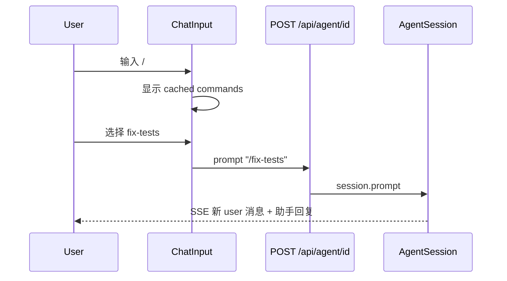
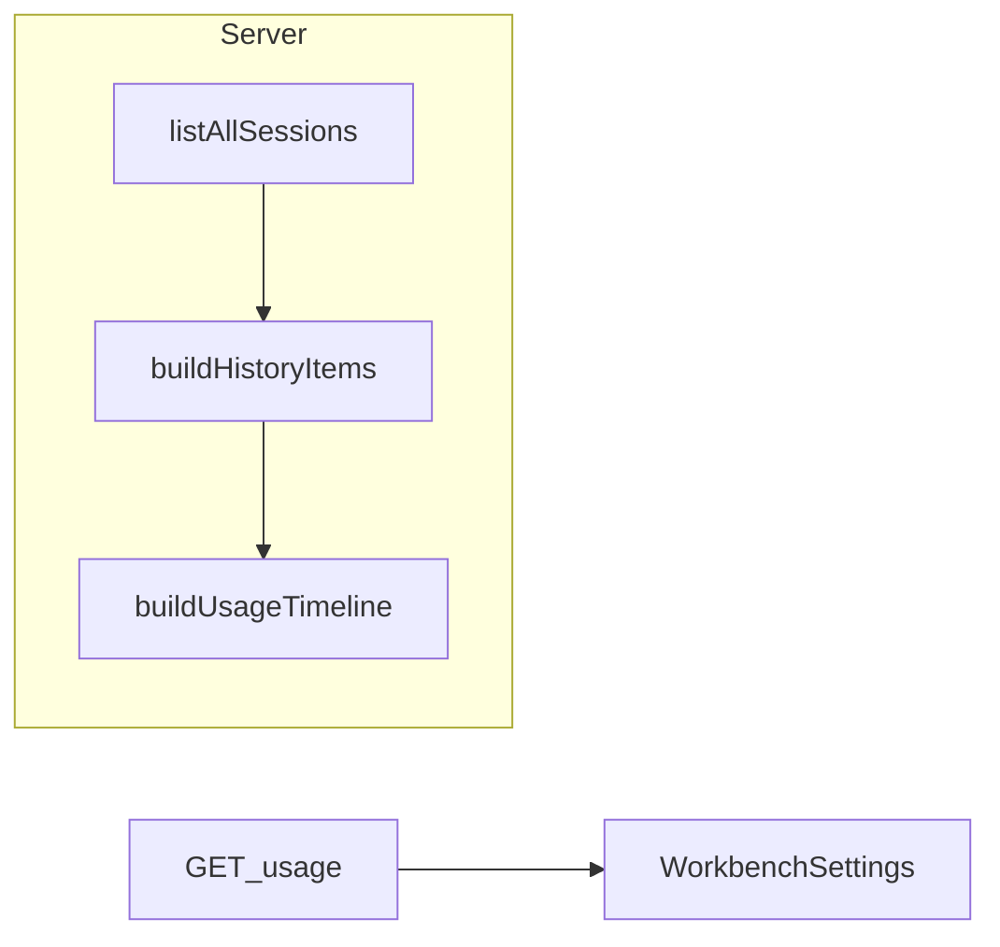

# M3 产品设计 & 技术方案

**版本**：2026-06-04  
**状态**：设计稿（待评审）  
**关联**：[总计划](./plan-pi-web-macos-workbench.md) · [M3 清单](./m3-checklist.md) · [M2 清单](./m2-checklist.md) · [贯穿原则](./product-principles.md)

---

## 0. 文档目的

为 M3（macOS 独立 App **v2.0.0**）提供可评审的**产品规格**与**实现蓝图**，使清单项 M3-01～06 有统一的交互、数据与接口约定。实现时以本文 + `m3-checklist.md` 为验收依据。

**范围边界**

| 在 v2.0.0 | 不在 v2.0.0（v2.0.1 / backlog） |
|-----------|----------------------------------|
| `/` 命令（仅高级 + 偏好关默认） | 多会话 Tab（M3-07） |
| 聊天插入技能 | 模板库 + 一键自动化（M3-08） |
| 远程白话向导 | jsonl token/费用大盘（M3-09） |
| 7 日会话活动图 | Dock / Sparkle（M2-G） |
| 导出 HTML UI | 扩展管理 UI（M4） |

---

# 第一部分：产品设计

## 1. 用户与场景

| 角色 | M3 目标 | 默认路径是否改变 |
|------|---------|------------------|
| **主用户** | 无新增必填步骤；不出现 `/`、远程术语 | 否 |
| **进阶用户** | 在聊天里用 pi 命令与技能；看用量趋势；导出 HTML | 仅显式开「高级」后 |
| **远程协作者** | 手机/另一台设备只读或配对查看 | 设置内向导，默认关 |

**核心场景（Happy Path，进阶）**

1. 设置 → 打开「高级模式」→ 可选打开「斜杠命令」→ 对话里输入 `/` 选命令 → 会话出现对应 user 消息（与 CLI 一致）。
2. 对话输入区 →「插入技能」→ 输入框出现 `/skill:foo` → 用户编辑后发送。
3. 设置 → 高级 → 远程访问 → 按向导配对 → 主界面无 jwt/token 文案。
4. 设置 → 看见近 7 日「开了多少对话 / 完成了多少」柱图。
5. 对话菜单 →「导出对话」→ 下载 HTML → Finder 可打开。

**成功标准（与清单里程碑一致）**

- 默认用户：输入 `/` 行为与现网相同（无补全层）。
- 进阶用户：`get_commands` 列表可补全并执行；技能插入不自动发送。
- 远程：zh-CN/en 主流程可读；配对仍可用。
- 用量：7 日柱图与侧栏会话 `modified` 分布一致；本地 ~100 会话加载 &lt;2s。
- 导出：与 `export_html` RPC / 现有 `GET .../export.html` 内容一致。
- `npm run test:m3` 绿。

---

## 2. 信息架构（M3 增量）

```
pi-web（内嵌 WebView）
├── 对话 ?session=<id>
│   ├── ChatInput
│   │   ├── [M3-02] 插入技能（所有模式可见，不依赖斜杠开关）
│   │   ├── [M3-01] / 命令补全（advancedMode ∧ showSlashCommands）
│   │   └── [M3-05] 溢出菜单 → 导出 HTML
│   └── （M1/M2 分支、Fork、Clone 不变）
└── 设置 workbenchView=settings
    ├── [M3-03] 远程访问（白话向导，默认关）
    ├── [M3-04] 近 7 日会话活动
    ├── [M3-01] 斜杠命令开关（高级区块内，默认关）
    └── 关于 / 模型 / …（不变）
```

**默认 vs 高级（M3 门禁）**

| 能力 | 默认用户 | 进阶（高级模式） |
|------|----------|------------------|
| `/` 补全 | 无 | 需再开「斜杠命令」偏好 |
| 插入技能 | 可用（一步插入，不发送） | 同左 |
| 远程 | 设置深处；默认关 | 同左 |
| 7 日用量图 | 可不展示或折叠在「高级」 | 设置页卡片 |
| 导出 HTML | 聊天菜单可见（非高级专属） | 同左 |

原则：M3 **不**把 Tab、自动化、Dock 拉进默认 IA（见 `product-principles.md` §1）。

---

## 3. 关键用户流程

### 3.1 斜杠命令（M3-01）

**启用条件**（三者同时满足才挂载补全 UI）：

```text
advancedMode === true
AND preferences.showSlashCommands === true   // 默认 false
AND activeRpcSession.isAlive()
```

**交互**

| 步骤 | 行为 |
|------|------|
| 输入 `/` | 若光标前为行首或空白后，打开补全浮层 |
| 继续输入 | 按 `name` 前缀过滤（含 `skill:xxx`） |
| ↑↓ / Enter | 选中项 |
| 确认 | 调用 `POST /api/agent/[id]` → `{ type: "prompt", message: "/<name>" }`（与现网发消息同路径）；**不**在客户端解析扩展逻辑 |
| Esc | 关闭浮层，保留已输入字符 |

**设置**

- 位置：`WorkbenchSettings` →「高级」区块。
- 文案：「斜杠命令」+「在输入 `/` 时显示可执行命令（扩展、模板、技能）」。
- 关闭高级模式时：隐藏该开关；运行时 `showSlashCommands` 仍持久化，再次开高级后恢复。

**与 M3-02 分工**

| 能力 | 数据源 | 行为 |
|------|--------|------|
| M3-01 命令面板 | `get_commands`（会话 cwd 上下文） | 选中 → **发送** `/name` |
| M3-02 插入技能 | `GET /api/skills?cwd=` | 选中 → **仅写入**输入框 `/skill:name` |

不得再建第三套「技能浏览器」全页 UI；M3-01 列表已含 `source: "skill"` 项。



---

### 3.2 插入技能（M3-02）

| 步骤 | 行为 |
|------|------|
| 点击「技能」或图标按钮 | 打开 Popover，列表来自 `/api/skills` |
| 选择一项 | 在光标处插入 ` /skill:<name>`（name 与 SKILL frontmatter / 目录名一致） |
| 发送 | 用户自行 Enter；**禁止**自动 `prompt` |

**空态**：无技能 →「未找到技能」+ 链接设置内 Skills 说明（若已有 `SkillsConfig` 则链到设置）。

**i18n**：`chat.insertSkill`、`chat.insertSkillEmpty` 等。

---

### 3.3 远程访问白话向导（M3-03）

**现状**：`RemoteAccessSettings` + `RemotePairingModal` 功能完整；问题是术语（token、jwt、relay）与步骤密度。

**目标结构**

```
远程访问 [开关，默认关]
├── 一句话：「让手机或另一台设备查看本机对话（可设为只读）」
├── [开启向导] 三步
│   1. 用途与风险（只读推荐、勿暴露到公网）
│   2. 生成配对（QR +「复制配对链接」主按钮）
│   3. 已连接设备列表 + 撤销
├── 已配对设备（现有 sessions 列表，文案「配对设备」）
└── ▼ 开发者（折叠）
    ├── 允许的主机名
    ├── 中继命令 npm run relay:…（保留，小字）
    └── 审计日志（保留）
```

**文案映射（示例）**

| 现技术词 | 用户可见（zh-CN） |
|----------|-------------------|
| master token | 管理密码（仅首次显示，勿分享） |
| pairing URL | 配对链接 |
| readOnly | 只允许查看，不能发送消息 |
| relay | 中继（可选，开发者） |
| jwt | **不出现在**主流程按钮 |

**文档**：设置底部链到 `docs/remote-access.md`（新建或扩展现有 macOS 指南一节）。

---

### 3.4 用量概览（M3-04）

**指标（v2.0.0）**

- 按 **UTC 日历日**（或本地日，实现时二选一并写死）统计过去 7 天：
  - `started`：当日 `created` 落入该日的会话数
  - `completed`：当日 `modified` 且 `status === completed`（来自 `scene-metadata`）
  - `active`：当日有 `modified` 且仍为 `active`

**展示**：设置页单卡片 + 7 柱（或点线图）；悬停显示当日三数。

**不做的**：token、费用、按模型拆分、CSV（→ M3-09）。



---

### 3.5 导出 HTML（M3-05）

| 步骤 | 行为 |
|------|------|
| 用户点击「导出对话」 | 若 `isStreaming` → 禁用 + 提示「请等待回复结束」 |
| 请求 | `GET /api/agent/[id]/export.html`（已有 route，带 auth） |
| 成功 | 浏览器下载 `attachment` HTML |
| 失败 | 白话：「无法导出」「找不到对话」 |

**入口（二选一，实现时择一，建议双入口）**

1. `ChatInput` 溢出菜单（主路径）
2. `WorkbenchSettings` →「数据与稳定性」区（与 M1-F 叙述一致）

**可选增强（非验收）**：macOS 壳 `revealInFinder` — 不阻塞 v2.0.0。

---

### 3.6 交付（M3-06）

- 用户文档：`docs/advanced-features.md`（斜杠命令、技能、远程、导出、用量；无 RPC 字段名）。
- 发布说明：`docs/v2.0-release-notes.md`。
- 自动化：`scripts/m3-preflight.mjs` + `npm run test:m3`。

---

# 第二部分：技术设计

## 4. 架构总览

```
┌─────────────────────────────────────────────────────────┐
│ AppShell / ChatWindow / ChatInput / WorkbenchSettings   │
└────────────┬───────────────────────────────┬────────────┘
             │                               │
     POST /api/agent/[id]              GET /api/usage?days=7
     GET  /api/skills                  GET /api/agent/.../export.html
     GET/PUT /api/preferences
             │
     ┌───────▼────────┐
     │ rpc-manager    │  + get_commands (新增)
     │ AgentSession   │  + export_html (已有)
     └────────────────┘
```

**不变**

- 单会话 per `sessionId` 的 `globalThis.__piSessions` 模型（v2.0.0 不引入 `switch_session`）。
- Fork 后 `destroy()` 语义（M2）。
- 偏好唯一写路径：`PUT /api/preferences` → `pi-web-preferences.json`。

---

## 5. RPC 与 API

### 5.1 `get_commands`（M3-01）

**rpc-manager.ts**

```typescript
case "get_commands": {
  return this.inner.getCommands(); // 或 session 上等价 API，以实现时 pi 包为准
}
```

**类型**（对齐 `pi-coding-agent` `SlashCommandInfo` / RPC 响应）：

```typescript
interface RpcSlashCommand {
  name: string;
  description?: string;
  source: "extension" | "prompt" | "skill";
  sourceInfo?: { path?: string; scope?: string; source?: string };
}
```

**缓存策略**

- `ChatWindow` 在 RPC 会话就绪后拉取一次；`cwd` 或扩展重载后可 `refreshCommands()`（监听 `modelsRefreshKey` 或手动刷新按钮 — 非必须 v2.0.0）。
- 测试 fixture：`test/fixtures/get-commands.sample.json`（Pre-flight 录制）。

### 5.2 导出（M3-05）

**已有**：`app/api/agent/[id]/export.html/route.ts` → `export_html` → `readFileSync` → `Content-Disposition: attachment`。

**客户端**：`fetch` + `blob` + `<a download>`，或 `window.open`（需带 cookie / auth header 时用 fetch）。

**无需**新增 RPC 类型。

### 5.3 用量（M3-04）

**lib/usage.ts** 扩展：

```typescript
export interface UsageDayBucket {
  date: string; // YYYY-MM-DD
  started: number;
  completed: number;
  active: number;
}

export interface UsageTimeline {
  days: UsageDayBucket[];
  generatedAt: string;
}

export function buildUsageTimeline(
  history: ProductHistoryItem[],
  days: number,
  generatedAt?: string,
): UsageTimeline;
```

**app/api/usage/route.ts**

```typescript
// GET /api/usage?days=7
// Response: { usage: UsageSummary, timeline?: UsageTimeline }
```

向后兼容：无 `days` 参数时仍返回原 `UsageSummary`（M1 顶栏 stats 不受影响）。

**性能**：仅用 `listAllSessions()` + metadata；**不**扫描 jsonl。若会话数 &gt;500，可在实现时加「仅统计最近 90 天 modified」截断（Pre-flight 用本地数据验证）。

### 5.4 技能（M3-02）

**已有**：`GET /api/skills?cwd=`、`PATCH` 禁用模型调用。

**插入名规则**：与 `get_commands` 中 skill 项一致，使用 `skill:<dirName>` 前缀（RPC 文档约定）。

---

## 6. 偏好与状态

**pi-web-preferences.json** 新增字段：

```typescript
export interface PiWebPreferences {
  // ...existing
  /** Default false. Effective only when UI advancedMode is on. */
  showSlashCommands?: boolean;
}
```

**AppShell**（可选）：`advancedMode` 仍用 `localStorage` 或现有 state — 与 M1/M2 一致，**不**写入 preferences（除非产品决定持久化高级模式，当前保持 session 级）。

| 状态 | 存储 | 说明 |
|------|------|------|
| `showSlashCommands` | preferences | 跨重启 |
| `advancedMode` | 现有机制 | 关则隐藏斜杠开关与 M3-01 UI |
| commands 列表 | React state in ChatInput/ChatWindow | 内存缓存 |

---

## 7. 组件改动清单

| 文件 | M3 项 | 改动要点 |
|------|-------|----------|
| `lib/rpc-manager.ts` | 01 | `get_commands` case |
| `lib/pi-web-preferences.ts` | 01 | `showSlashCommands` |
| `app/api/preferences/route.ts` | 01 | 透传新字段 |
| `components/ChatInput.tsx` | 01, 02, 05 | 补全层、技能 Popover、导出项 |
| `components/ChatWindow.tsx` | 01 | 加载 commands、传 props |
| `components/WorkbenchSettings.tsx` | 01, 03, 04 | 开关、用量卡、远程文案 |
| `components/RemoteAccessSettings.tsx` | 03 | 向导步骤 + 折叠开发者区 |
| `components/RemotePairingModal.tsx` | 03 | 白话标题/按钮 |
| `lib/usage.ts` | 04 | `buildUsageTimeline` |
| `app/api/usage/route.ts` | 04 | `?days=7` |
| `lib/i18n/messages/*.ts` | 全部 | 新 key |
| `docs/advanced-features.md` | 06 | 新建 |
| `scripts/m3-preflight.mjs` | 06 | 冒烟 |
| `package.json` | 06 | `"test:m3"` |

**不改动（v2.0.0）**：`TabBar.tsx`（仍仅文件 Tab）、`AppShell` 多 session 路由模型。

---

## 8. 测试与 Pre-flight

### 8.1 Pre-flight（编码前）

| 项 | 产出 |
|----|------|
| `get_commands` | dev 会话调用成功 → fixture |
| `switch_session` spike | 本文附录 A（v2.0.1） |
| jsonl `message.usage` 抽样 | 记录比例 → 决定是否 M3-09 |
| 产品确认 | v2.0.0 不做 automation API |

### 8.2 `npm run test:m3`（建议覆盖）

1. `GET /api/health` — `piVersion` 存在  
2. `GET/PUT /api/preferences` — `showSlashCommands` round-trip  
3. 有 fixture session 时 `POST get_commands` 或 agent route 包装 — `commands.length > 0`  
4. `GET /api/usage?days=7` — `timeline.days.length === 7`  
5. `GET /api/agent/[id]/export.html` — `Content-Type` html + 非空 body（可用 mock session）  

单元测试：

- `buildUsageTimeline` 边界（空历史、跨时区日界）  
- `ChatInput` 纯函数：插入技能字符串、斜杠触发条件（若抽 helper）

---

## 9. 实施顺序

与清单一致：

```text
Pre-flight → M3-03 → M3-05 → M3-02 → M3-01 → M3-04 → M3-06
```

**并行**：M3-03 与 M3-05 可不同人；M3-01 依赖 `get_commands` Pre-flight。

---

## 10. 风险与对策

| 风险 | 对策 |
|------|------|
| `get_commands` 与 `/api/skills` 名称不一致 | 以 `get_commands` 为准做 M3-01；M3-02 插入时校验 name 或在 UI 标注 |
| 斜杠命令误触默认用户 | 双重门禁 + 默认关偏好 |
| 用量日界与时区 | 文档写死规则；测试固定 UTC 或 `Asia/Shanghai` |
| 导出大会话慢 | 加载态 + 超时白话；不阻塞流式 |
| 远程文案改坏配对 | 仅改展示字符串；不改 `/api/remote/*` 契约 |

---

# 附录 A：v2.0.1 多 Tab — `switch_session` Spike（≤1 页）

**问题**：当前 `globalThis.__piSessions` 以 URL `sessionId` 为键，一个 id 一个 `AgentSessionWrapper`。多 Tab 需在同一 WebView 内快速切换多个会话。

**方案 A — RPC `switch_session`（单 wrapper）**

- 保持一个 wrapper，切换时 `send({ type: "switch_session", sessionPath })`。
- **优点**：内存一份 AgentSession；与 pi RPC 语义一致。  
- **缺点**：切换前须处理 streaming、M2 `destroy` 与 fork 语义冲突；扩展 `session_before_switch` 可能取消；热切换需清 SSE 订阅。

**方案 B — 多 wrapper Map（推荐倾向）**

- 键仍为 `sessionId`，最多 N 个活跃 wrapper（LRU 淘汰 + idle timeout）。
- Tab 切换只改 URL `?session=`，命中 Map 则无需 reload file。
- **优点**：与现 M2 fork（destroy 旧 id）兼容性好；切换无 RPC 取消链。  
- **缺点**：内存 N 倍；需 cap（如 5）防止 OOM。

**Tab UI**：`TabBar` 增加 `session` 类型 tab；`AppShell` 维护 `openSessionIds[]` 顺序。

**决策门**：v2.0.1 开工前用 1 天 spike 验证 A 的 `cancelled` 与流式中断；若失败则锁定 B。

---

# 附录 B：v2.0.1 模板与一键运行（M3-08 草案）

- 存储：`pi-web-preferences.json` → `templates: { id, title, message, toolMode?, cwd? }[]` 或独立 `templates.json`。  
- 运行：`POST /api/agent/new` + 模板字段；**不**新建 `/api/automation`。  
- UI：设置页列表 +「一键运行」；默认首页 **不**放四场景卡片。

---

# 附录 C：v2.0.1 Token 用量（M3-09 草案）

- Pre-flight 抽样 `~/.pi/agent/sessions/**/*.jsonl` 是否含 `message.usage`。  
- 若 &gt;80% 有：新增 `lib/usage-tokens.ts` 限流扫描（最近 M 文件 / 最近 30 天）。  
- API：`GET /api/usage?days=30&tokens=1`；UI 第二张卡或切换 Tab。

---

## 变更记录

| 日期 | 说明 |
|------|------|
| 2026-06-04 | 初稿：M3-01～06 产品 + 技术；v2.0.1 附录 A/B/C |
